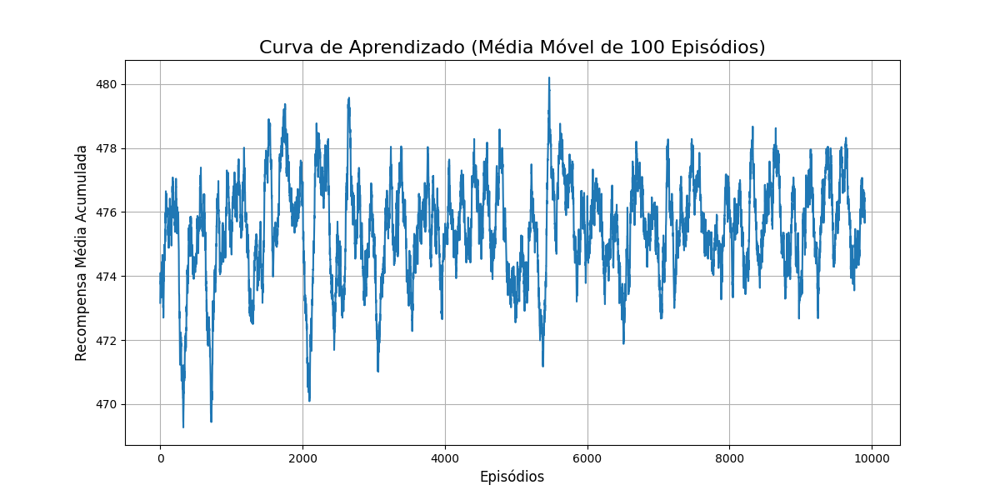

# Aprendizagem por Reforço em Ambientes Estocásticos: O Robô de Reciclagem

Este projeto implementa uma solução de Aprendizagem por Reforço (RL) para o problema do **Robô de Reciclagem**, um exemplo clássico de Processo de Decisão de Markov (MDP) com transições de estado estocásticas (não-determinísticas).

O objetivo é treinar um agente autônomo, usando o algoritmo **Q-Learning**, para aprender uma política de decisão ótima que maximize a coleta de latinhas ao mesmo tempo que gerencia de forma inteligente o nível de sua bateria para evitar a necessidade de um resgate.

---

##  Tabela de Conteúdos
1. [Visão Geral do Problema](#-visão-geral-do-problema)
2. [Estrutura do Projeto](#-estrutura-do-projeto)
3. [Como Executar](#-como-executar)
4. [Análise dos Resultados](#-análise-dos-resultados)
    - [Curva de Aprendizado](#curva-de-aprendizado)
    - [Evolução da Tabela Q](#evolução-da-tabela-q)
5. [Conclusão](#-conclusão)


##  Visão Geral do Problema

O ambiente consiste em um robô com dois estados de bateria (`High`, `Low`) e três ações possíveis (`Search`, `Wait`, `Recharge`). As ações têm resultados probabilísticos:
* **Procurar (`Search`)** gera uma alta recompensa, mas arrisca diminuir a bateria. Se a bateria já estiver baixa, procurar pode esgotá-la completamente, resultando em uma grande penalidade.
* **Esperar (`Wait`)** gera uma pequena recompensa e não afeta a bateria.
* **Recarregar (`Recharge`)** não gera recompensa, mas restaura a bateria para o nível `High` com segurança.

O desafio para o agente é aprender a melhor ação a ser tomada em cada estado, mesmo sem saber de antemão as probabilidades de transição.

##  Estrutura do Projeto

O código é modularizado para promover clareza e manutenibilidade:

* `main_train.py`: O script orquestrador. Ele inicializa o ambiente e o agente, executa o loop de treinamento, coleta os dados e invoca as funções de plotagem.
* `robot_mdp_env.py`: Define a classe `RecyclingRobotMDP`, que encapsula a lógica, os estados, as ações e as regras de transição do ambiente.
* `q_learning_agent.py`: Define a classe `QLearningAgent`, contendo a implementação do algoritmo Q-Learning, incluindo a Tabela Q e as estratégias de escolha de ação.
* `plotting_utils.py`: Um módulo utilitário com funções dedicadas para gerar e salvar as visualizações dos resultados do treinamento.

## Análise dos Resultados
As visualizações geradas são fundamentais para entender o comportamento e a eficácia do agente.

## Curva de Aprendizado
O gráfico abaixo mostra a recompensa total acumulada pelo agente, suavizada por uma média móvel de 100 episódios para facilitar a visualização da tendência.


## Análise:
A curva demonstra um padrão clássico de aprendizado em RL:

Fase Inicial (Exploração): Nos primeiros episódios, as recompensas são baixas e voláteis. O agente está explorando o ambiente, tomando muitas ações aleatórias (devido ao epsilon-greedy) e frequentemente incorrendo na penalidade de resgate.

Fase de Aprendizado: À medida que o treinamento avança, a curva sobe de forma consistente. O agente começa a preencher sua Tabela Q com valores mais precisos e a explorar menos, favorecendo ações que historicamente levaram a melhores resultados.

Fase de Convergência: Na parte final, a curva se estabiliza em um patamar alto e positivo. Isso indica que o agente convergiu para uma política eficaz e está consistentemente maximizando suas recompensas, evitando a penalidade de resgate.

Evolução da Tabela Q
Os heatmaps abaixo são "snapshots" do cérebro do agente (a Tabela Q) em diferentes estágios do treinamento. As cores mais claras representam valores Q mais altos (ações mais desejáveis).

Análise:


Esta visualização nos conta a história de como o agente aprende sua política:

Episódio 0: A tabela está zerada. O agente não tem nenhum conhecimento prévio.

Episódio 2500 (Início do aprendizado): O agente já descobriu que a ação Search gera uma alta recompensa imediata (+10), então o valor Q para (High, Search) começa a crescer. Ele também já deve ter sofrido a penalidade de resgate (-20), tornando o valor para (Low, Search) negativo e, portanto, indesejável.

Episódio 5000 (Conhecimento se propagando): Os valores começam a se refinar. O agente percebe que, embora Recharge no estado Low tenha recompensa imediata de 0, essa ação o leva de volta ao estado High, onde ele sabe que pode obter altas recompensas futuras com a ação Search. Esse conhecimento do futuro é propagado para trás pela equação de Bellman, aumentando o valor Q de (Low, Recharge).

Episódio 10000 (Política Ótima): A Tabela Q converge. Fica claro que:

No estado High, a ação Search tem o maior valor, pois é a que mais gera recompensas com um risco controlado.

No estado Low, a ação Recharge se torna a mais valiosa. O agente aprendeu a lição: a recompensa imediata de Search não compensa o risco catastrófico de precisar de resgate. É melhor jogar pelo seguro, recarregar, e voltar a um estado de alta recompensa potencial.

##  Como Executar

Siga os passos abaixo para rodar a simulação e gerar os resultados.

### 1. Pré-requisitos
Certifique-se de ter Python 3 instalado. Você precisará das seguintes bibliotecas, que podem ser instaladas via `pip`:

```bash
pip install numpy matplotlib seaborn tqdm
