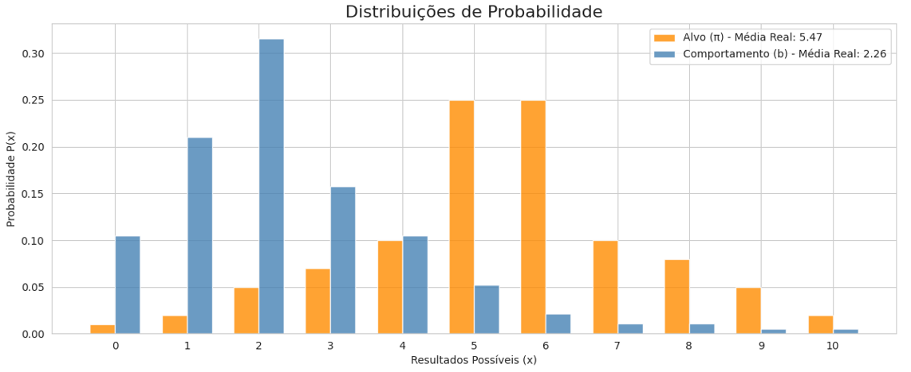
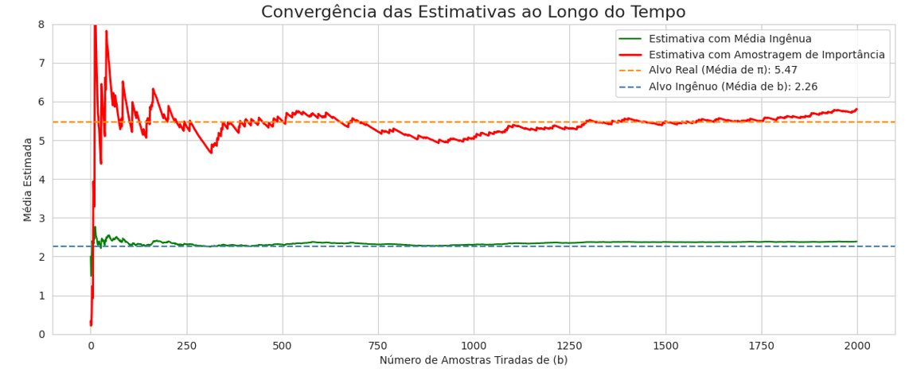

# Explorações em Aprendizado por Reforço e Estatística

[](https://www.python.org/downloads/)
[](https://opensource.org/licenses/MIT)

## Amostragem de Importância (Importance Sampling)

-   **Arquivo:** `importance_sampling_demo.py`

### Conceito

Em muitos cenários, se quer calcular uma característica (como a média) de uma **distribuição alvo (π)**, mas só pode coletar dados de uma **distribuição de comportamento (b)** diferente. 
A Amostragem de Importância é uma técnica de Monte Carlo que permite fazer exatamente isso.

Ela responde à pergunta: "Como posso usar as amostras que *tenho* (de `b`) para tirar conclusões sobre o processo que *quero* entender (de `π`)?"

### A Lógica

A ideia central é **ponderar** cada amostra retirada da distribuição de comportamento (`b`) para corrigir a discrepância de probabilidade. Pode ser feito se multiplicando o valor da amostra por uma **razão de importância (ρ)**.

A razão `ρ` é simplesmente a probabilidade daquela amostra ter ocorrido na distribuição alvo dividida pela probabilidade dela ter ocorrido na distribuição de comportamento:

$$ \rho = \frac{\pi(\text{amostra})}{b(\text{amostra})} $$

-   Se uma amostra era **mais provável** em `π` do que em `b`, seu peso `ρ` será > 1, aumentando sua contribuição para a média.
-   Se uma amostra era **menos provável** em `π` do que em `b`, seu peso `ρ` será < 1, diminuindo sua contribuição.

Dessa forma, a média das amostras ponderadas converge para a média real da distribuição alvo `π`, mesmo que nunca tenha tirado uma única amostra dela diretamente.

### Como Executar

Para rodar a simulação e visualizar os gráficos, execute o seguinte comando no seu terminal:

```bash
python estimar_media_de_pi_usando_amostra_de_beta.py
```

### Resultados Esperados

O script gerará uma figura com dois gráficos que ilustram o poder da técnica:

1.  **Gráfico 1: Distribuições de Probabilidade**
    Este gráfico mostra o desafio. A distribuição azul (b), de onde foi tirado todas as amostras, favorece valores baixos (o pico é em 2). A distribuição laranja (π), da qual deseja saber a média, favorece valores mais altos
    (o pico é em 5 e 6). As médias reais são bem diferentes

    


2.  **Gráfico 2: Convergência das Estimativas**
    Esta linha mostra a estimativa corrigida. Note que ela é mais ruidosa no início, pois algumas amostras raras podem ter um peso (ρ) muito alto. No entanto, à medida que é coletado mais e mais amostras, ela inequivocamente converge para a
    linha tracejada laranja, que é a média real de π.

    

3.  O estimador ingênuo de Monte Carlo é tendencioso, convergindo para a média da distribuição do comportamento ( ≈ 2,71 ) em vez da média verdadeira da distribuição alvo ( ≈ 5,55 ).

---

## Licença

Este projeto está licenciado sob a Licença MIT.
