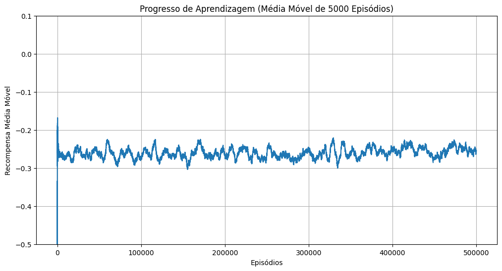
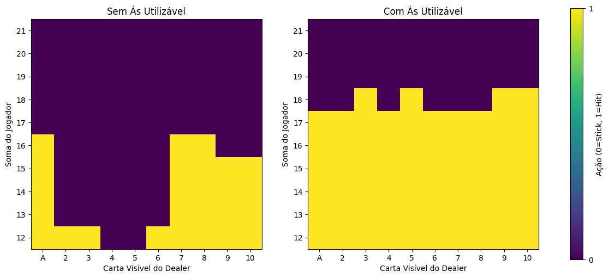

# Agente de Blackjack com Aprendizado por Reforço

[](https://www.python.org/downloads/)
[](https://opensource.org/licenses/MIT)

Um agente de IA que aprende a estratégia ótima do Blackjack do zero, utilizando o método *Monte Carlo com Exploring Starts* e a biblioteca Gymnasium do Farama Foundation.

---

## 📖 Sumário

Este projeto explora uma questão fundamental do Aprendizado por Reforço (RL): como um agente pode dominar um jogo de probabilidades como o Blackjack sem conhecimento prévio de suas regras ou estratégias?

O objetivo é construir e treinar um agente capaz de desenvolver uma política de decisão ótima (`π*`) unicamente através da experiência adquirida ao jogar milhares de partidas. A solução é uma implementação em Python do algoritmo **Monte Carlo com Exploring Starts**, um método *model-free* que aprende o valor de cada ação em cada estado do jogo.

## 🃏 O Desafio: Dominando o Blackjack

No Blackjack, o objetivo é vencer a mão do Dealer (a Mesa) sem ultrapassar 21 pontos. O agente precisa tomar decisões sequenciais (Pedir carta ou Parar) com base em sua soma atual, na carta visível do Dealer e na presença de um Ás utilizável. Este ambiente oferece um cenário clássico para problemas de RL, com um balanço claro entre risco e recompensa.

## 🧠 Metodologia: Aprendizado por Reforço

A aprendizagem do agente é guiada pelo princípio da **Iteração de Política Generalizada (GPI)**, um ciclo contínuo de avaliação e melhoria da política.

1.  **Avaliação da Política (Policy Evaluation):** O agente joga episódios completos (partidas) com uma política inicial. Ao final de cada episódio, o retorno (recompensa: +1 para vitória, -1 para derrota, 0 para empate) é calculado e propagado para trás, atualizando o valor esperado para cada par (estado, ação) visitado. O valor de uma ação em um estado, $Q(s, a)$, é simplesmente a média de todos os retornos recebidos após tomar aquela ação naquele estado.

2.  **Melhoria da Política (Policy Improvement):** Após cada episódio, a política é atualizada de forma "gananciosa" (*greedy*). Para cada estado, o agente passa a escolher a ação que possui o maior valor $Q$ estimado até o momento.

Este ciclo de `jogar -> avaliar -> melhorar` é a engrenagem que, ao longo de milhares de episódios, leva o agente a convergir para uma política ótima. A fórmula de atualização para o valor Q a cada retorno $G_t$ observado é:

$$ Q(s, a) \leftarrow Q(s, a) + \alpha [G_t - Q(s, a)] $$

*(Nesta implementação "first-visit", α é efetivamente 1/N(s,a), onde N é a contagem de visitas, pois calculamos a média direta dos retornos).*

## 🛠️ Pilha Tecnológica

-   **Simulação de Ambiente:** `gymnasium`
-   **Computação Numérica:** `numpy`
-   **Manipulação de Dados:** `pandas`
-   **Visualização de Dados:** `matplotlib`
-   **Barra de Progresso:** `tqdm`

## ⚙️ Instalação

Para executar este projeto, você precisa ter o Python 3.9+ instalado.

1.  **Clone o repositório:**
    ```bash
    git clone [URL_DO_SEU_REPOSITORIO_GITLAB]
    cd [NOME_DO_PROJETO]
    ```

2.  **Crie e ative um ambiente virtual:**
    ```bash
    python -m venv venv
    source venv/bin/activate
    # No Windows, use: venv\Scripts\activate
    ```

3.  **Instale as dependências a partir do `requirements.txt`:**
    ```bash
    pip install -r requirements.txt
    ```
    *(Nota: Certifique-se de criar um arquivo `requirements.txt` com as bibliotecas listadas na Pilha Tecnológica).*

## ▶️ Uso

Para iniciar o treinamento do agente, execute o script principal:

```bash
python main.py
```

O script irá treinar o agente por 500.000 episódios, exibindo o progresso e a política aprendida para cenários específicos a cada 50.000 episódios. Ao final do treinamento, dois gráficos serão gerados e exibidos.

## 📊 Resultados e Análise

Após 500.000 episódios, o agente convergiu para uma política estável, descobrindo 280 estados de jogo únicos e alcançando uma recompensa média de **-0.2533** nos últimos 50.000 jogos — um resultado robusto que se aproxima do desempenho ótimo.

```
100%|██████████| 500000/500000 [05:01<00:00, 1660.85it/s]

--- Progresso no Episódio: 500000/500000 ---
  Recompensa Média (últimos 50000 episódios): -0.2533
  Tamanho da Política (estados conhecidos): 280
------------------------------------------------------------
  Política Aprendida para Cenários Monitorados:
    - Estado (20, 10, False)          : Ação -> Stick
    - Estado (12, 3, False)           : Ação -> Hit
    - Estado (16, 10, False)          : Ação -> Stick
    - Estado (13, 2, False)           : Ação -> Stick
    - Estado (17, 9, False)           : Ação -> Stick
    - Estado (19, 10, True)           : Ação -> Stick
    - Estado (17, 6, True)            : Ação -> Hit
    - Estado (15, 4, True)            : Ação -> Hit
    - Estado (13, 10, True)           : Ação -> Hit
    - Estado (21, 1, False)           : Ação -> Stick
------------------------------------------------------------
```

### Inteligência Descoberta: Análise da Política

A política final revela decisões estratégicas complexas que não foram pré-programadas:

-   **Entendimento do "Soft 17":** O agente aprendeu a jogada crítica (e não óbvia) de pedir carta (*Hit*) com um "soft 17" (Ás+6) contra um 6 do Dealer, aproveitando a flexibilidade do Ás para melhorar sua mão sem risco de estourar.
-   **Gestão de Risco:** Em situações desfavoráveis, como ter 16 contra um 10 do Dealer, o agente aprendeu a parar (*Stick*), adotando uma política conservadora para minimizar a alta probabilidade de ultrapassar 21.

O gráfico de progresso de aprendizagem mostra a convergência da recompensa média ao longo do tempo.



A política final é visualizada abaixo. Cada mapa de calor mostra a ação ideal (Amarelo=Hit, Roxo=Stick) para cada cenário, distinguindo entre mãos com e sem um Ás utilizável.



Nota-se que o agente é muito mais agressivo quando possui um Ás utilizável, pois compreendeu que ele atua como uma "rede de segurança", eliminando o risco imediato de estourar e abrindo oportunidades para melhorar a mão.

### Conexão com Engenharia de Controle e Automação

Este projeto serve como uma prova de conceito para a aplicação de abordagens de RL em problemas de otimização. A mesma lógica usada para otimizar decisões em um jogo pode ser transposta para otimizar políticas de controle em sistemas do mundo real, como na gestão de energia de edifícios, no controle de processos industriais ou na calibração de sistemas autônomos, onde o objetivo é maximizar uma recompensa (eficiência, produção) ao longo do tempo.

## 📄 Licença

Este projeto está licenciado sob a Licença MIT. Veja o arquivo [LICENSE](LICENSE) para mais detalhes.
