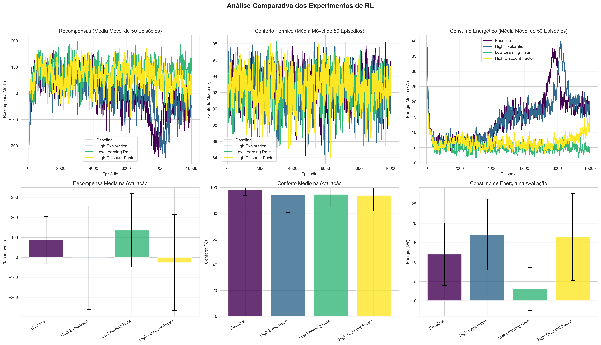
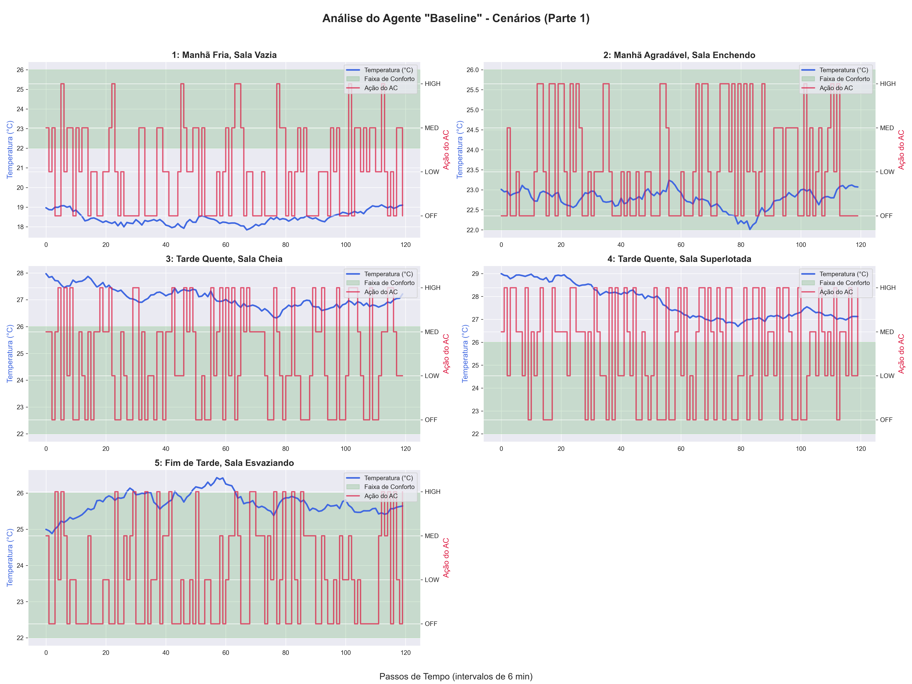
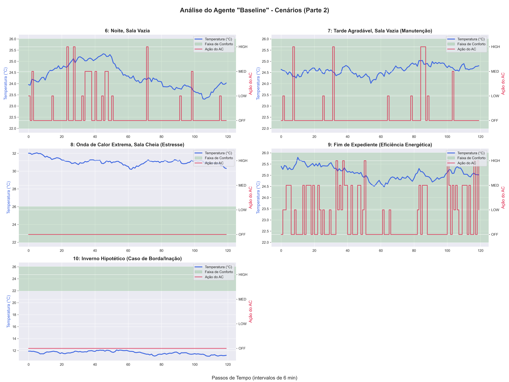
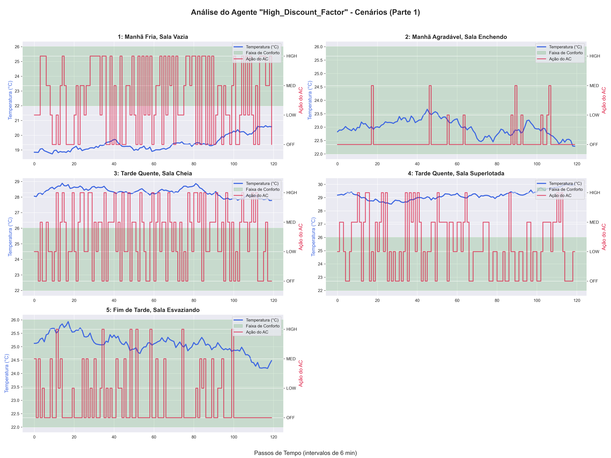
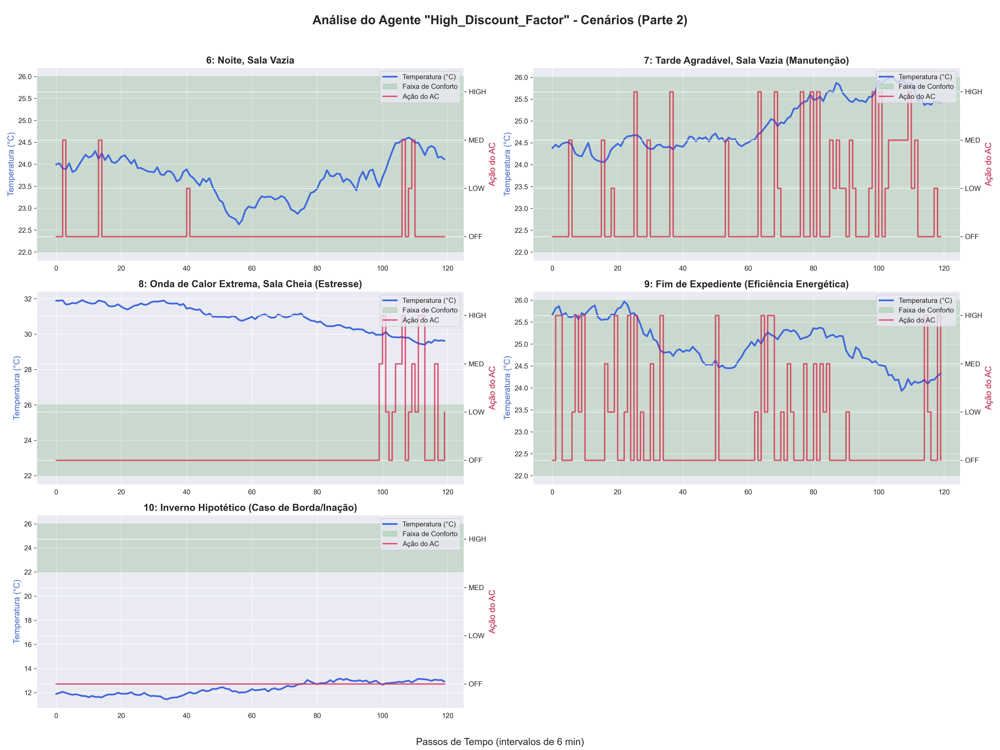
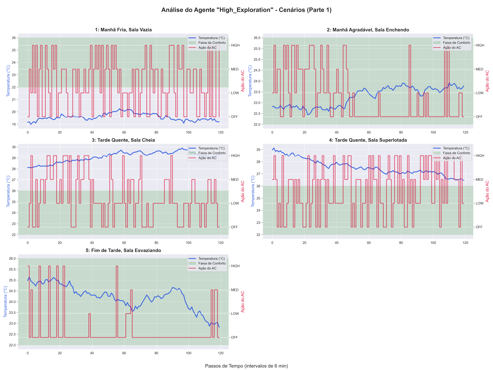
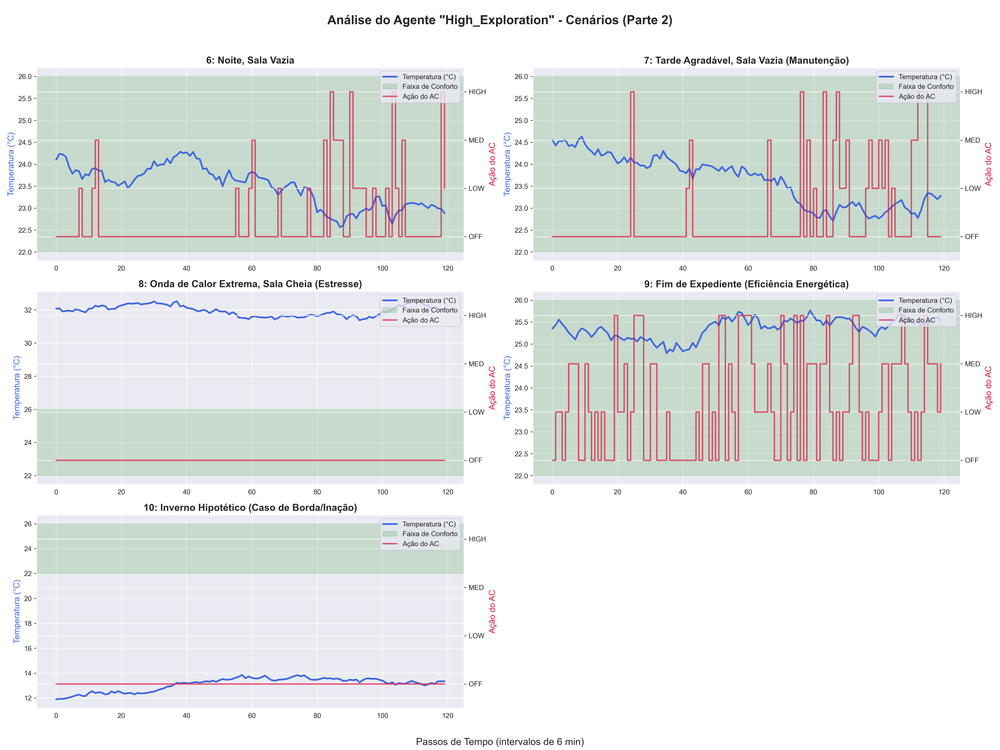
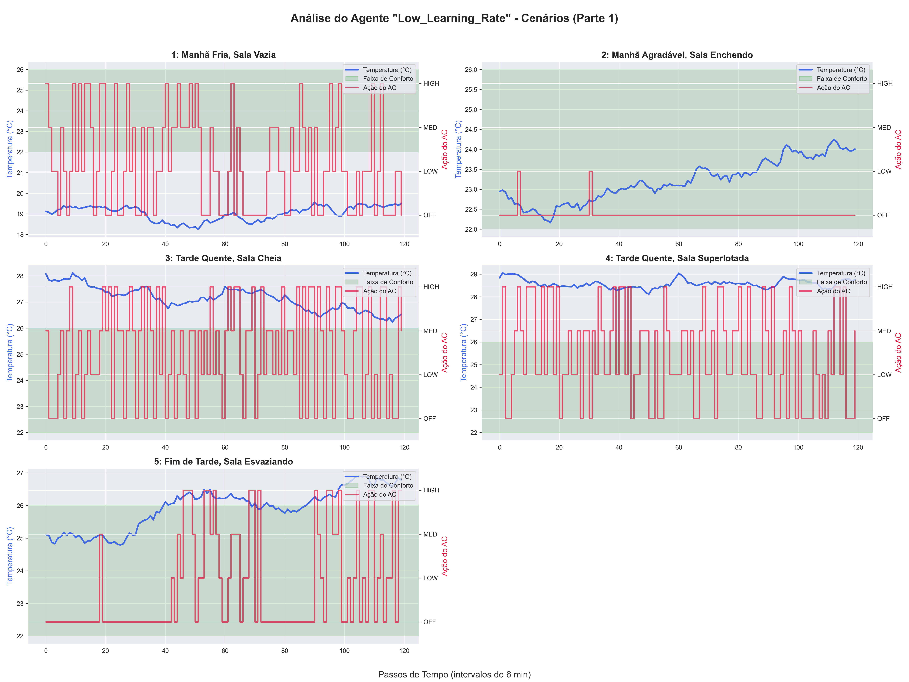
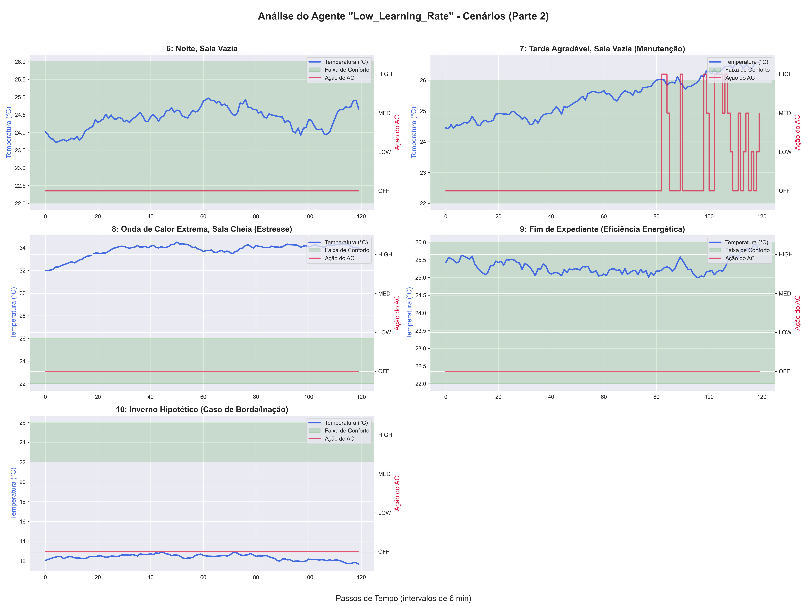

# Relatório de Análise de Agentes - results_20251002_174127

Este relatório documenta o comportamento de cada agente treinado sob um conjunto de 10 cenários de teste.

---

## 📊 Análise Comparativa Geral

A imagem abaixo compara o desempenho final de todos os agentes durante a fase de avaliação, considerando Recompensa, Conforto e Consumo de Energia.

---

## 🔎 Análise Detalhada do Agente: `baseline`

### Resumo Quantitativo

| Cenário                                         |   Temp. Média (°C) |   Tempo em Conforto (%) |   Energia Total (kW) |   Recompensa Média | Ação Predominante   |
|:------------------------------------------------|-------------------:|------------------------:|---------------------:|-------------------:|:--------------------|
| 1: Manhã Fria, Sala Vazia                       |              18.45 |                     0   |                184   |              -6.95 | OFF                 |
| 2: Manhã Agradável, Sala Enchendo               |              22.77 |                   100   |                208   |              -0.42 | OFF                 |
| 3: Tarde Quente, Sala Cheia                     |              27.07 |                     0   |                268.5 |              -6.64 | OFF                 |
| 4: Tarde Quente, Sala Superlotada               |              27.75 |                     0   |                299.5 |              -6.78 | HIGH                |
| 5: Fim de Tarde, Sala Esvaziando                |              25.72 |                    82.5 |                201.5 |              -1.55 | OFF                 |
| 6: Noite, Sala Vazia                            |              24.33 |                   100   |                 52.5 |               0.46 | OFF                 |
| 7: Tarde Agradável, Sala Vazia (Manutenção)     |              24.61 |                   100   |                 35.5 |               0.67 | OFF                 |
| 8: Onda de Calor Extrema, Sala Cheia (Estresse) |              31.08 |                     0   |                  0   |             -15    | OFF                 |
| 9: Fim de Expediente (Eficiência Energética)    |              25.1  |                   100   |                130.5 |              -0.06 | OFF                 |
| 10: Inverno Hipotético (Caso de Borda/Inação)   |              11.63 |                     0   |                  0   |             -15    | OFF                 |

### Gráficos de Comportamento em Cenários

---

## 🔎 Análise Detalhada do Agente: `high_discount_factor`

### Resumo Quantitativo

| Cenário                                         |   Temp. Média (°C) |   Tempo em Conforto (%) |   Energia Total (kW) |   Recompensa Média | Ação Predominante   |
|:------------------------------------------------|-------------------:|------------------------:|---------------------:|-------------------:|:--------------------|
| 1: Manhã Fria, Sala Vazia                       |              19.43 |                    0    |                308   |              -6.72 | HIGH                |
| 2: Manhã Agradável, Sala Enchendo               |              22.98 |                  100    |                 21   |               0.67 | OFF                 |
| 3: Tarde Quente, Sala Cheia                     |              28.33 |                    0    |                275   |              -6.83 | MED                 |
| 4: Tarde Quente, Sala Superlotada               |              29.18 |                    0    |                229   |              -6.67 | LOW                 |
| 5: Fim de Tarde, Sala Esvaziando                |              25.1  |                  100    |                 99.5 |              -0.07 | OFF                 |
| 6: Noite, Sala Vazia                            |              23.73 |                  100    |                 15   |               0.8  | OFF                 |
| 7: Tarde Agradável, Sala Vazia (Manutenção)     |              24.94 |                   99.17 |                107   |               0.09 | OFF                 |
| 8: Onda de Calor Extrema, Sala Cheia (Estresse) |              30.93 |                    0    |                 42.5 |             -13.55 | OFF                 |
| 9: Fim de Expediente (Eficiência Energética)    |              25    |                  100    |                110.5 |               0.07 | OFF                 |
| 10: Inverno Hipotético (Caso de Borda/Inação)   |              12.35 |                    0    |                  0   |             -15    | OFF                 |

### Gráficos de Comportamento em Cenários

---

## 🔎 Análise Detalhada do Agente: `high_exploration`

### Resumo Quantitativo

| Cenário                                         |   Temp. Média (°C) |   Tempo em Conforto (%) |   Energia Total (kW) |   Recompensa Média | Ação Predominante   |
|:------------------------------------------------|-------------------:|------------------------:|---------------------:|-------------------:|:--------------------|
| 1: Manhã Fria, Sala Vazia                       |              19.58 |                       0 |                268.5 |              -6.72 | MED                 |
| 2: Manhã Agradável, Sala Enchendo               |              23.27 |                     100 |                150.5 |               0.01 | OFF                 |
| 3: Tarde Quente, Sala Cheia                     |              29.1  |                       0 |                233.5 |              -6.34 | LOW                 |
| 4: Tarde Quente, Sala Superlotada               |              27.56 |                       0 |                297   |              -6.71 | LOW                 |
| 5: Fim de Tarde, Sala Esvaziando                |              24.21 |                     100 |                 51   |               0.57 | OFF                 |
| 6: Noite, Sala Vazia                            |              23.49 |                     100 |                 62   |               0.4  | OFF                 |
| 7: Tarde Agradável, Sala Vazia (Manutenção)     |              23.63 |                     100 |                 78.5 |               0.4  | OFF                 |
| 8: Onda de Calor Extrema, Sala Cheia (Estresse) |              31.95 |                       0 |                  0   |             -15    | OFF                 |
| 9: Fim de Expediente (Eficiência Energética)    |              25.36 |                     100 |                222   |              -0.49 | OFF                 |
| 10: Inverno Hipotético (Caso de Borda/Inação)   |              13.11 |                       0 |                  0   |             -15    | OFF                 |

### Gráficos de Comportamento em Cenários

---

## 🔎 Análise Detalhada do Agente: `low_learning_rate`

### Resumo Quantitativo

| Cenário                                         |   Temp. Média (°C) |   Tempo em Conforto (%) |   Energia Total (kW) |   Recompensa Média | Ação Predominante   |
|:------------------------------------------------|-------------------:|------------------------:|---------------------:|-------------------:|:--------------------|
| 1: Manhã Fria, Sala Vazia                       |              19.04 |                    0    |                222.5 |              -6.54 | OFF                 |
| 2: Manhã Agradável, Sala Enchendo               |              23.21 |                  100    |                  3   |               0.93 | OFF                 |
| 3: Tarde Quente, Sala Cheia                     |              27.14 |                    0    |                289.5 |              -6.97 | MED                 |
| 4: Tarde Quente, Sala Superlotada               |              28.58 |                    0    |                272.5 |              -6.66 | LOW                 |
| 5: Fim de Tarde, Sala Esvaziando                |              25.92 |                   46.67 |                153.5 |              -3.13 | OFF                 |
| 6: Noite, Sala Vazia                            |              24.39 |                  100    |                  0   |               1    | OFF                 |
| 7: Tarde Agradável, Sala Vazia (Manutenção)     |              25.45 |                   77.5  |                 67   |              -0.79 | OFF                 |
| 8: Onda de Calor Extrema, Sala Cheia (Estresse) |              33.81 |                    0    |                  0   |             -15    | OFF                 |
| 9: Fim de Expediente (Eficiência Energética)    |              25.31 |                  100    |                  0   |               1    | OFF                 |
| 10: Inverno Hipotético (Caso de Borda/Inação)   |              12.37 |                    0    |                  0   |             -15    | OFF                 |

### Gráficos de Comportamento em Cenários

