# Relatório de Análise de Agentes - results_20251007_103409

Análise do comportamento de agentes de RL para controle de climatização.

## 📊 Resumo Comparativo (Cenário de Estresse)

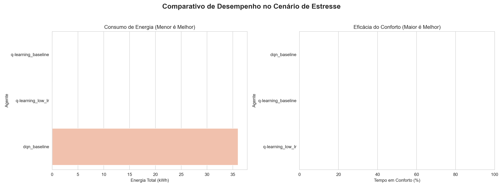

---

## 🔎 Agente: `dqn_baseline`

<strong>Clique para ver Parâmetros de Configuração</strong>

#### Parâmetros do Agente
|               |      Valor |
|:--------------|-----------:|
| state_size    |      4     |
| action_size   |      4     |
| episodes      |   2000     |
| buffer_size   | 100000     |
| batch_size    |     64     |
| gamma         |      0.99  |
| alpha         |      0.001 |
| tau           |      0.001 |
| update_every  |      4     |
| epsilon_start |      1     |
| epsilon_decay |      0.995 |
| epsilon_min   |      0.01  |

#### Parâmetros do Ambiente
|                                | Valor                                                                                   |
|:-------------------------------|:----------------------------------------------------------------------------------------|
| length                         | 8.0                                                                                     |
| width                          | 6.0                                                                                     |
| height                         | 3.0                                                                                     |
| max_occupancy                  | 30                                                                                      |
| thermal_mass                   | 1000.0                                                                                  |
| heat_transfer_coeff            | 0.5                                                                                     |
| heat_gain_per_person           | 0.1                                                                                     |
| temp_comfort_min               | 22.0                                                                                    |
| temp_comfort_max               | 26.0                                                                                    |
| temp_very_cold                 | 18.0                                                                                    |
| temp_very_hot                  | 30.0                                                                                    |
| initial_temp                   | 24.0                                                                                    |
| season                         | summer                                                                                  |
| energy_cost_peak_hours         | [18, 21]                                                                                |
| energy_penalty_multiplier_peak | 1.5                                                                                     |
| ac_cooling_power               | {'ACState.OFF': 0.0, 'ACState.LOW': 2.0, 'ACState.MEDIUM': 4.0, 'ACState.HIGH': 6.0}    |
| ac_energy_consumption          | {'ACState.OFF': 0.0, 'ACState.LOW': 1.5, 'ACState.MEDIUM': 3.0, 'ACState.HIGH': 5.0}    |
| reward_structure               | {'VERY_COLD': -15.0, 'COLD': -5.0, 'COMFORTABLE': 1.0, 'WARM': -5.0, 'VERY_HOT': -15.0} |

### Resumo Quantitativo

| Cenário                                 |   Temp. Média (°C) |   Tempo em Conforto (%) |   Energia Total (kWh) |   Recompensa Média |
|:----------------------------------------|-------------------:|------------------------:|----------------------:|-------------------:|
| 1: Manhã Fria, Sala Vazia              |              19.2  |                       0 |                  48.9 |              -5.65 |
| 2: Manhã Agradável, Sala Enchendo     |              23.18 |                     100 |                   0   |               1    |
| 3: Tarde Quente, Sala Cheia             |              28.11 |                       0 |                  36   |              -5.34 |
| 4: Tarde Quente, Sala Superlotada       |              28.85 |                       0 |                  36   |              -5.34 |
| 5: Fim de Tarde, Sala Esvaziando        |              24.52 |                     100 |                   0   |               1    |
| 6: Noite, Sala Vazia (Horário de Pico) |              24.31 |                     100 |                   0   |               1    |
| 7: Onda de Calor Extrema (Estresse)     |              31.92 |                       0 |                  36   |             -15.34 |
| 8: Inverno Hipotético (Inação)       |              11.06 |                       0 |                  50.2 |             -15.63 |

### Gráficos de Comportamento

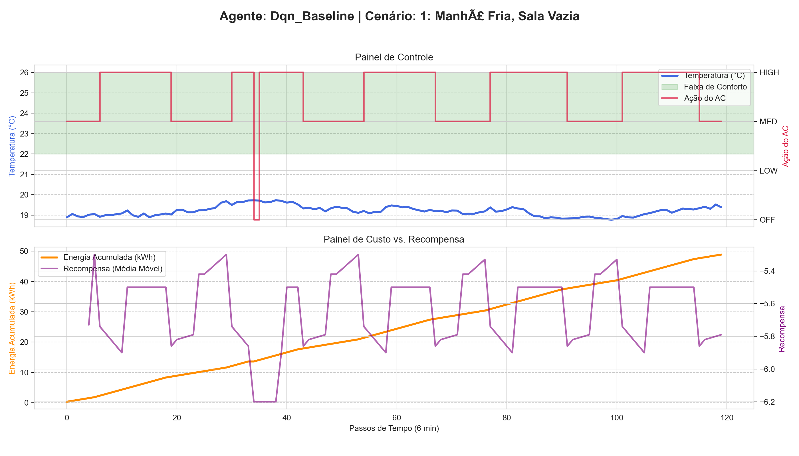
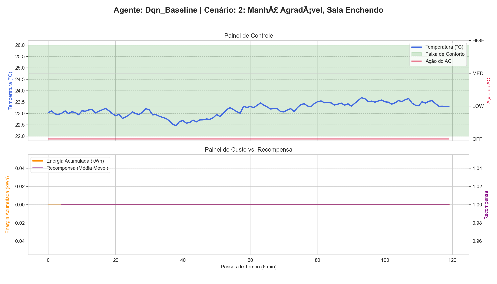
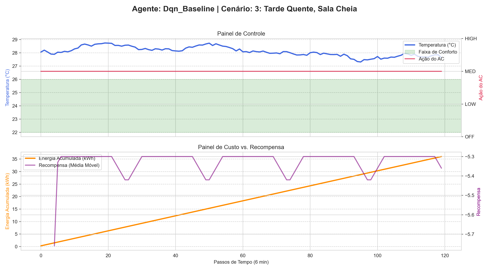
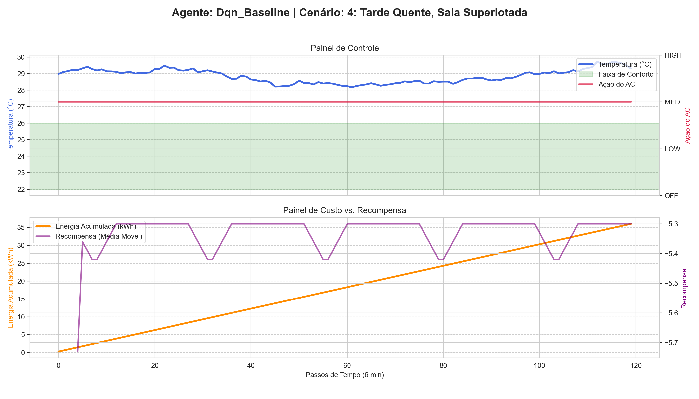
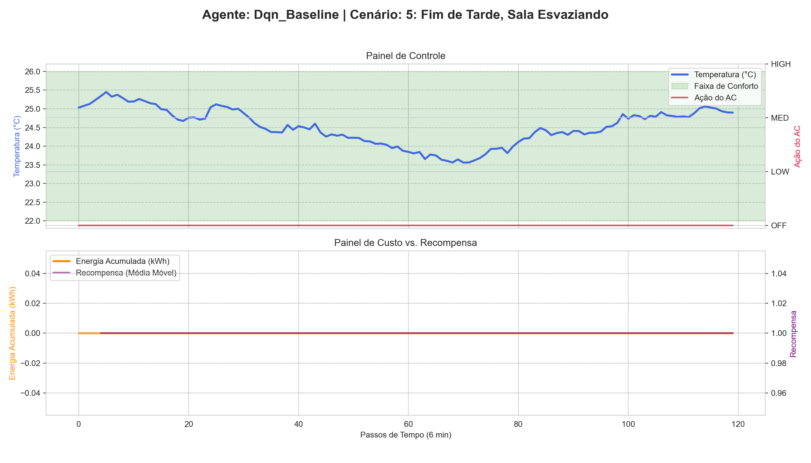
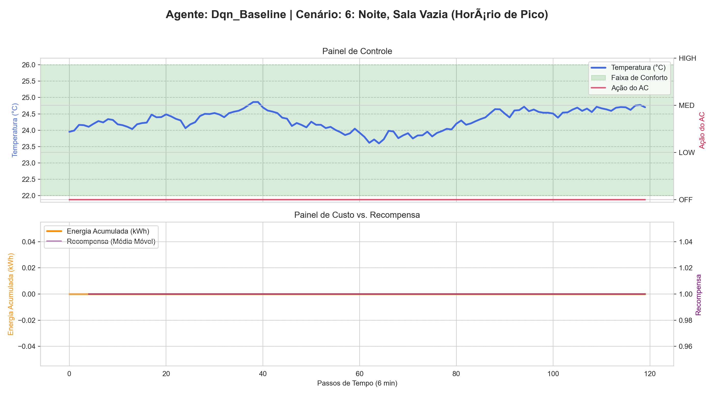
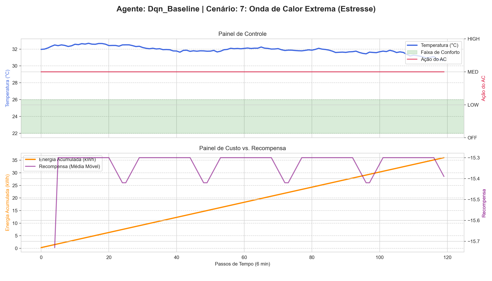
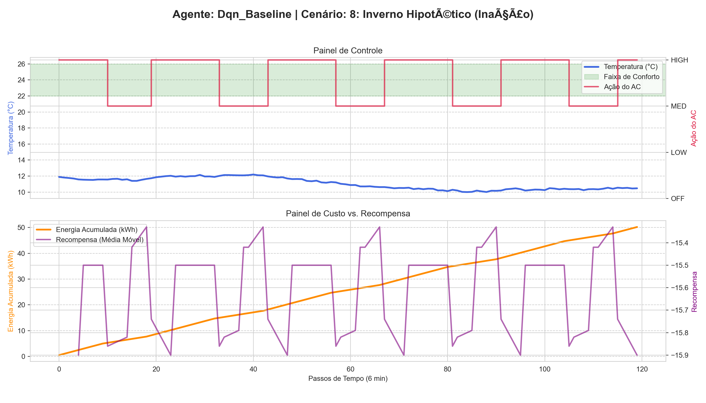
---

## 🔎 Agente: `q-learning_baseline`

<strong>Clique para ver Parâmetros de Configuração</strong>

#### Parâmetros do Agente
|                          |      Valor |
|:-------------------------|-----------:|
| alpha                    |     0.1    |
| gamma                    |     0.95   |
| epsilon                  |     1      |
| epsilon_min              |     0.01   |
| epsilon_decay            |     0.9995 |
| episodes                 | 10000      |
| early_stopping_patience  |   500      |
| early_stopping_threshold |     0.01   |

#### Parâmetros do Ambiente
|                                | Valor                                                                                   |
|:-------------------------------|:----------------------------------------------------------------------------------------|
| length                         | 8.0                                                                                     |
| width                          | 6.0                                                                                     |
| height                         | 3.0                                                                                     |
| max_occupancy                  | 30                                                                                      |
| thermal_mass                   | 1000.0                                                                                  |
| heat_transfer_coeff            | 0.5                                                                                     |
| heat_gain_per_person           | 0.1                                                                                     |
| temp_comfort_min               | 22.0                                                                                    |
| temp_comfort_max               | 26.0                                                                                    |
| temp_very_cold                 | 18.0                                                                                    |
| temp_very_hot                  | 30.0                                                                                    |
| initial_temp                   | 24.0                                                                                    |
| season                         | summer                                                                                  |
| energy_cost_peak_hours         | [18, 21]                                                                                |
| energy_penalty_multiplier_peak | 1.5                                                                                     |
| ac_cooling_power               | {'ACState.OFF': 0.0, 'ACState.LOW': 2.0, 'ACState.MEDIUM': 4.0, 'ACState.HIGH': 6.0}    |
| ac_energy_consumption          | {'ACState.OFF': 0.0, 'ACState.LOW': 1.5, 'ACState.MEDIUM': 3.0, 'ACState.HIGH': 5.0}    |
| reward_structure               | {'VERY_COLD': -15.0, 'COLD': -5.0, 'COMFORTABLE': 1.0, 'WARM': -5.0, 'VERY_HOT': -15.0} |

### Resumo Quantitativo

| Cenário                                 |   Temp. Média (°C) |   Tempo em Conforto (%) |   Energia Total (kWh) |   Recompensa Média |
|:----------------------------------------|-------------------:|------------------------:|----------------------:|-------------------:|
| 1: Manhã Fria, Sala Vazia              |              18.83 |                    0    |                 12.6  |              -6.29 |
| 2: Manhã Agradável, Sala Enchendo     |              23.28 |                  100    |                  1.55 |               0.85 |
| 3: Tarde Quente, Sala Cheia             |              28.07 |                    0    |                 24.2  |              -6.69 |
| 4: Tarde Quente, Sala Superlotada       |              28.4  |                    0    |                 10.15 |              -5.69 |
| 5: Fim de Tarde, Sala Esvaziando        |              24.24 |                  100    |                  0.6  |               0.93 |
| 6: Noite, Sala Vazia (Horário de Pico) |              22.82 |                   80.83 |                 13.1  |              -1.18 |
| 7: Onda de Calor Extrema (Estresse)     |              32.01 |                    0    |                  0    |             -15    |
| 8: Inverno Hipotético (Inação)       |              10.88 |                    0    |                  0    |             -15    |

### Gráficos de Comportamento

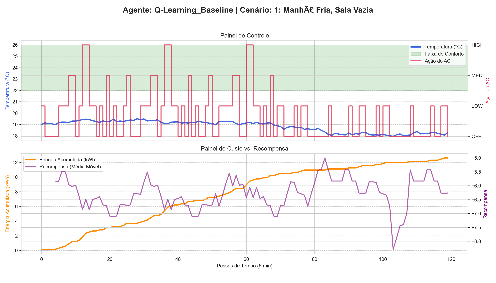
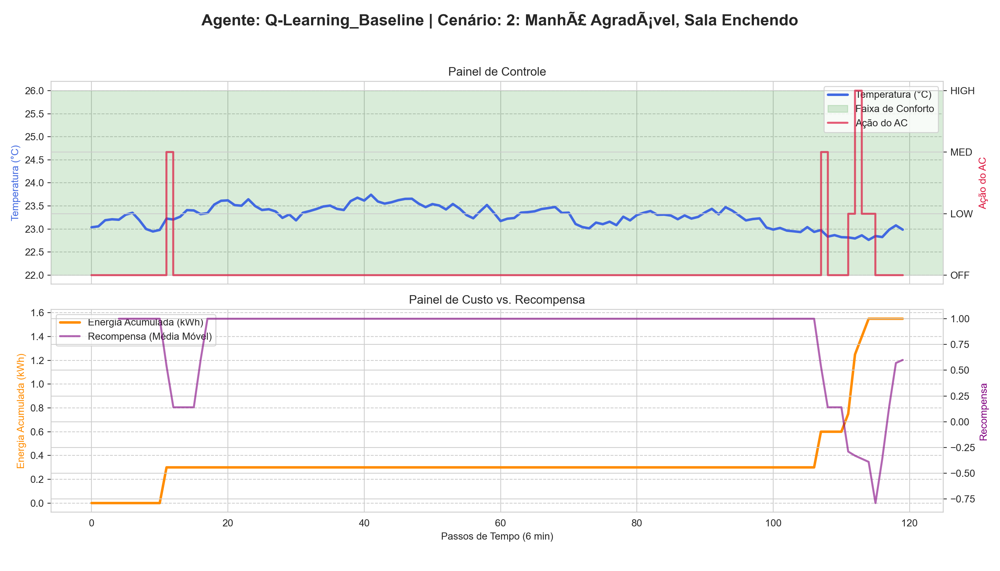
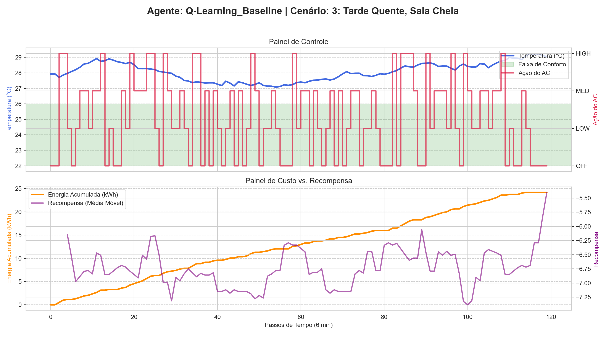
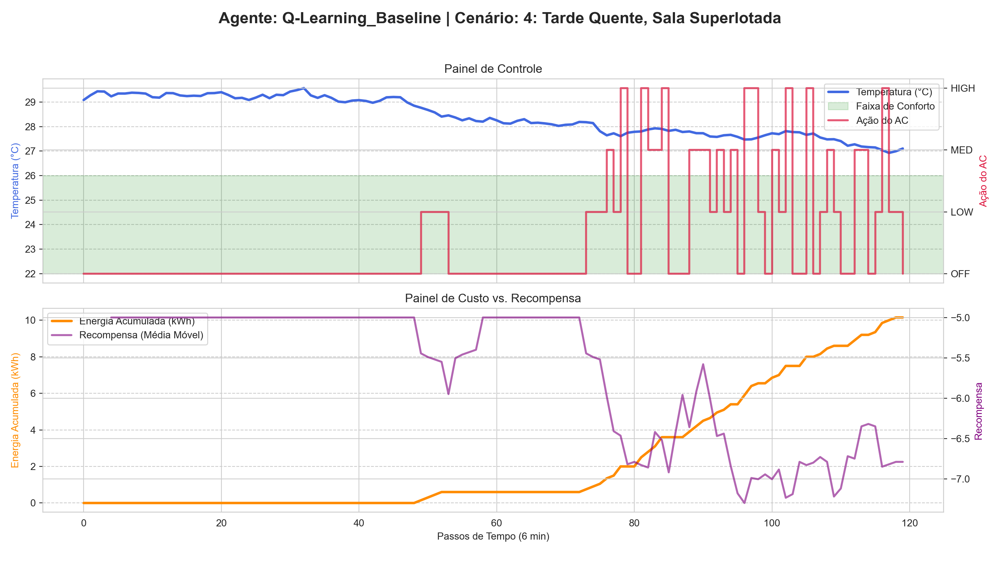
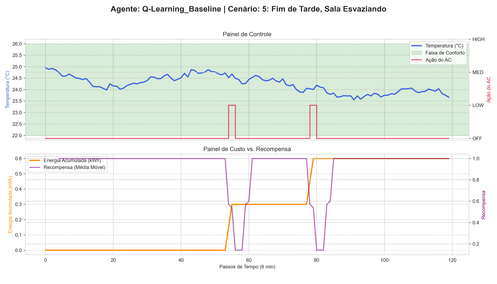
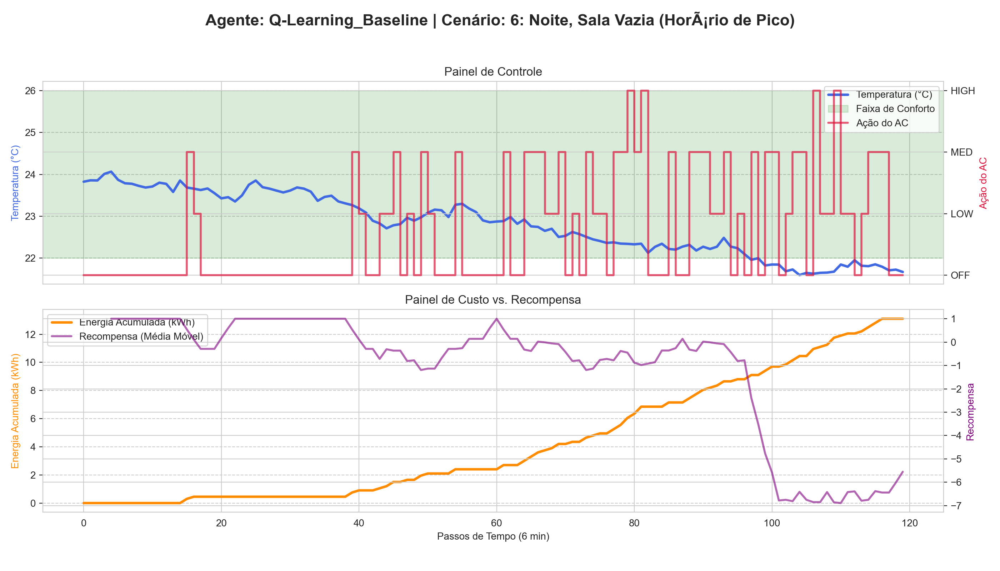
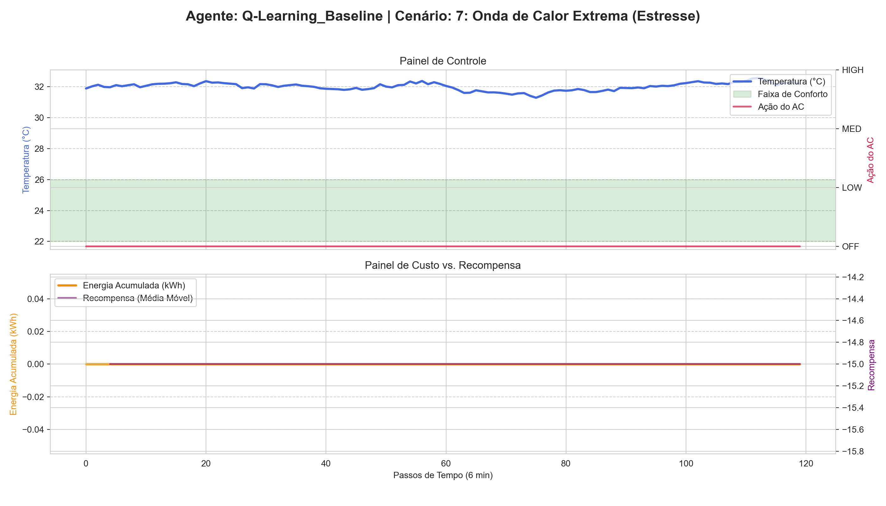
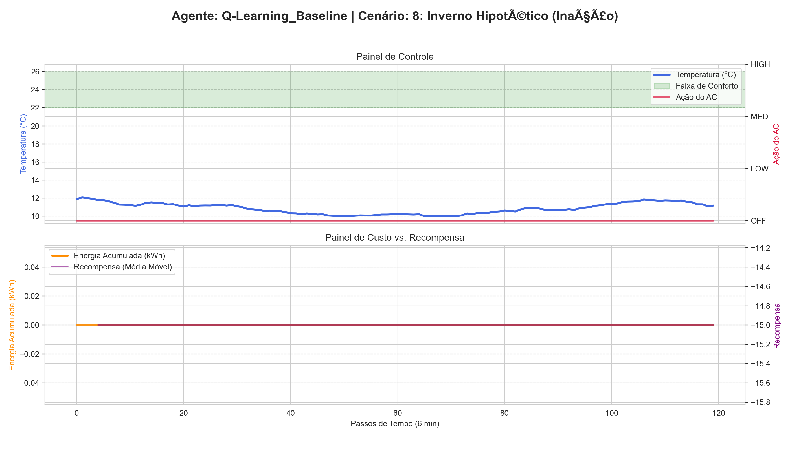
---

## 🔎 Agente: `q-learning_low_lr`

<strong>Clique para ver Parâmetros de Configuração</strong>

#### Parâmetros do Agente
|                          |      Valor |
|:-------------------------|-----------:|
| alpha                    |     0.01   |
| gamma                    |     0.95   |
| epsilon                  |     1      |
| epsilon_min              |     0.01   |
| epsilon_decay            |     0.9995 |
| episodes                 | 10000      |
| early_stopping_patience  |   500      |
| early_stopping_threshold |     0.01   |

#### Parâmetros do Ambiente
|                                | Valor                                                                                   |
|:-------------------------------|:----------------------------------------------------------------------------------------|
| length                         | 8.0                                                                                     |
| width                          | 6.0                                                                                     |
| height                         | 3.0                                                                                     |
| max_occupancy                  | 30                                                                                      |
| thermal_mass                   | 1000.0                                                                                  |
| heat_transfer_coeff            | 0.5                                                                                     |
| heat_gain_per_person           | 0.1                                                                                     |
| temp_comfort_min               | 22.0                                                                                    |
| temp_comfort_max               | 26.0                                                                                    |
| temp_very_cold                 | 18.0                                                                                    |
| temp_very_hot                  | 30.0                                                                                    |
| initial_temp                   | 24.0                                                                                    |
| season                         | summer                                                                                  |
| energy_cost_peak_hours         | [18, 21]                                                                                |
| energy_penalty_multiplier_peak | 1.5                                                                                     |
| ac_cooling_power               | {'ACState.OFF': 0.0, 'ACState.LOW': 2.0, 'ACState.MEDIUM': 4.0, 'ACState.HIGH': 6.0}    |
| ac_energy_consumption          | {'ACState.OFF': 0.0, 'ACState.LOW': 1.5, 'ACState.MEDIUM': 3.0, 'ACState.HIGH': 5.0}    |
| reward_structure               | {'VERY_COLD': -15.0, 'COLD': -5.0, 'COMFORTABLE': 1.0, 'WARM': -5.0, 'VERY_HOT': -15.0} |

### Resumo Quantitativo

| Cenário                                 |   Temp. Média (°C) |   Tempo em Conforto (%) |   Energia Total (kWh) |   Recompensa Média |
|:----------------------------------------|-------------------:|------------------------:|----------------------:|-------------------:|
| 1: Manhã Fria, Sala Vazia              |              18.47 |                       0 |                   5.5 |              -6.32 |
| 2: Manhã Agradável, Sala Enchendo     |              22.96 |                     100 |                   0   |               1    |
| 3: Tarde Quente, Sala Cheia             |              28.28 |                       0 |                  30.3 |              -6.88 |
| 4: Tarde Quente, Sala Superlotada       |              29.74 |                       0 |                   8.4 |              -8.82 |
| 5: Fim de Tarde, Sala Esvaziando        |              24.76 |                     100 |                   0   |               1    |
| 6: Noite, Sala Vazia (Horário de Pico) |              24.06 |                     100 |                   0   |               1    |
| 7: Onda de Calor Extrema (Estresse)     |              32.21 |                       0 |                   0   |             -15    |
| 8: Inverno Hipotético (Inação)       |              11.39 |                       0 |                   0   |             -15    |

### Gráficos de Comportamento

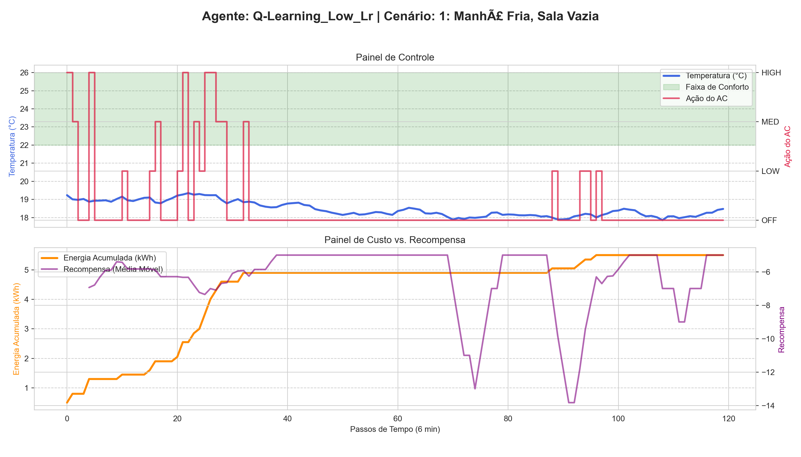
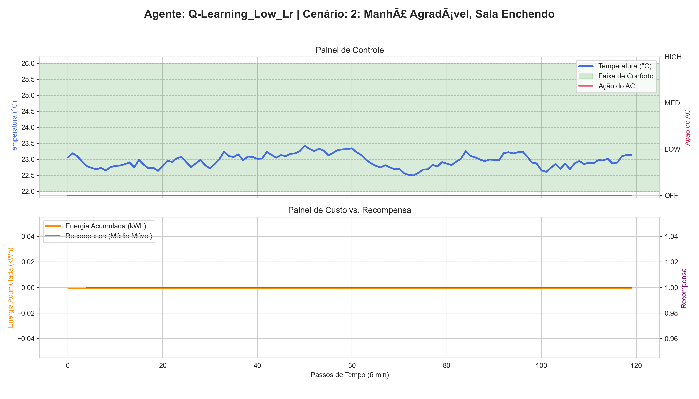
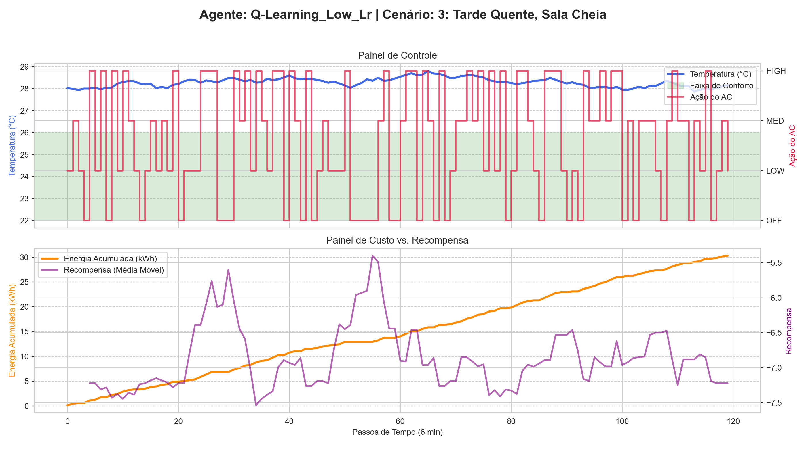
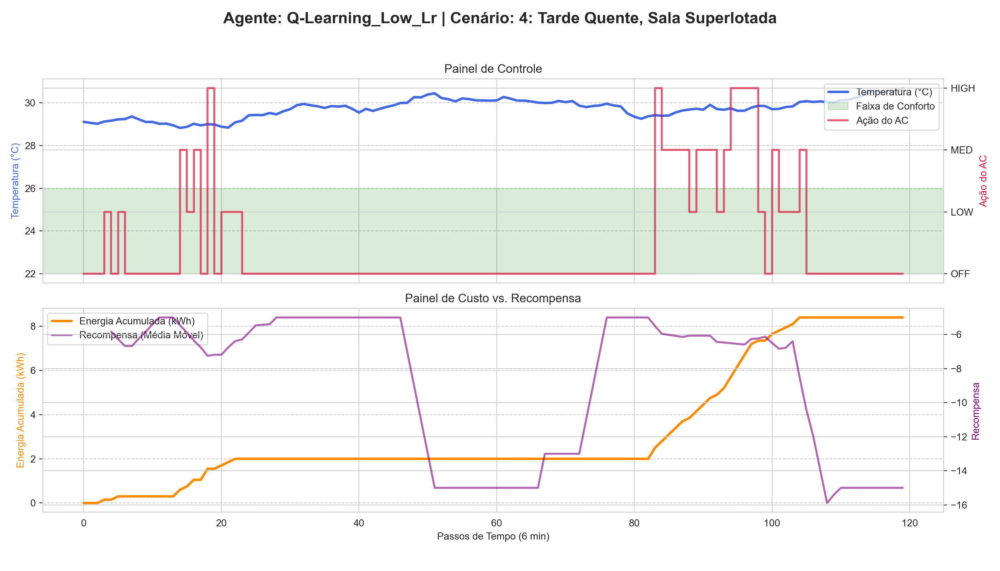
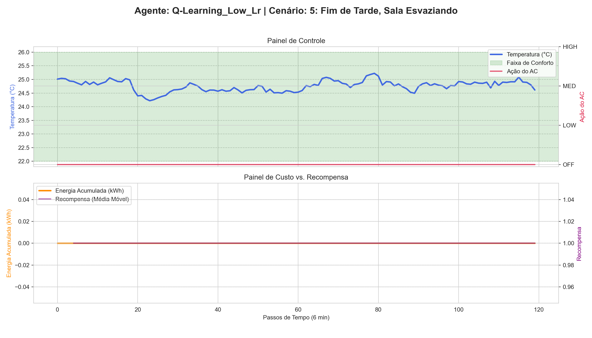
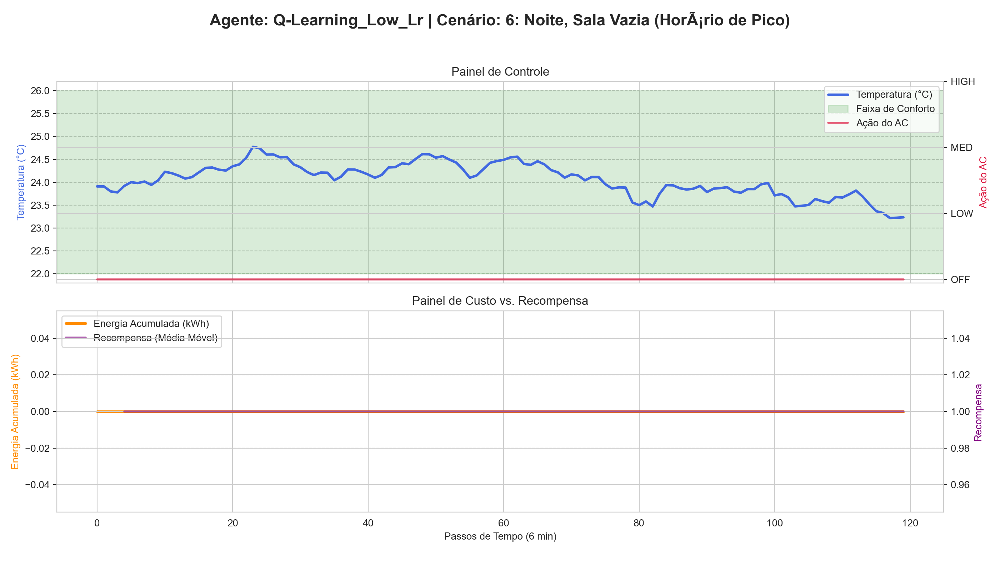
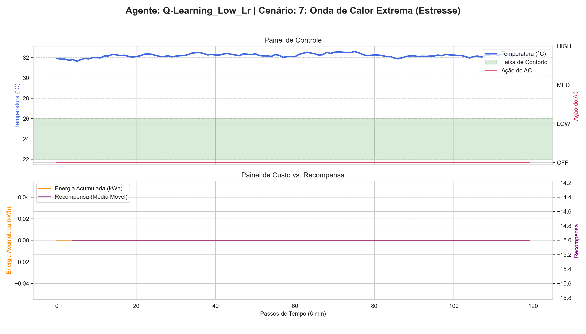
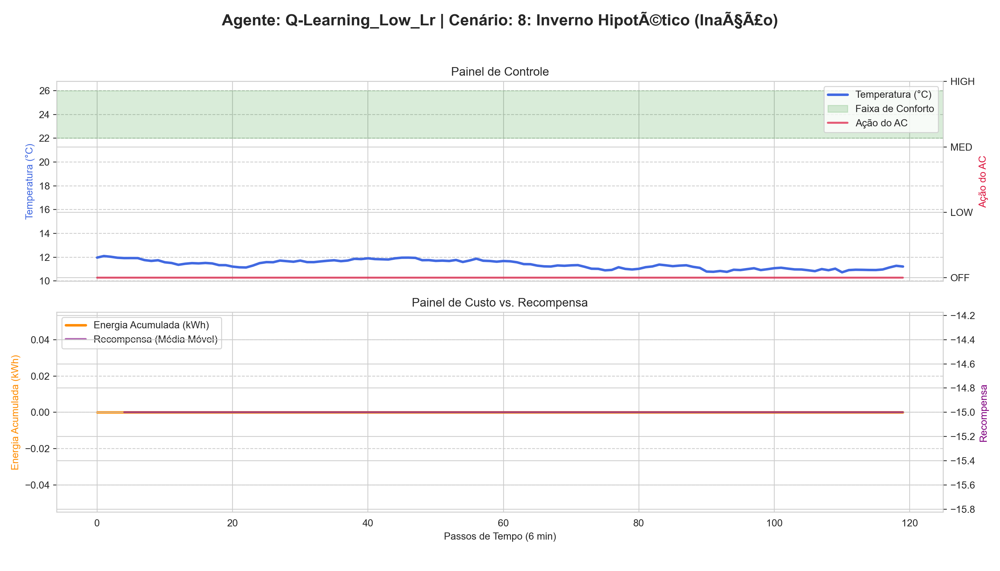
