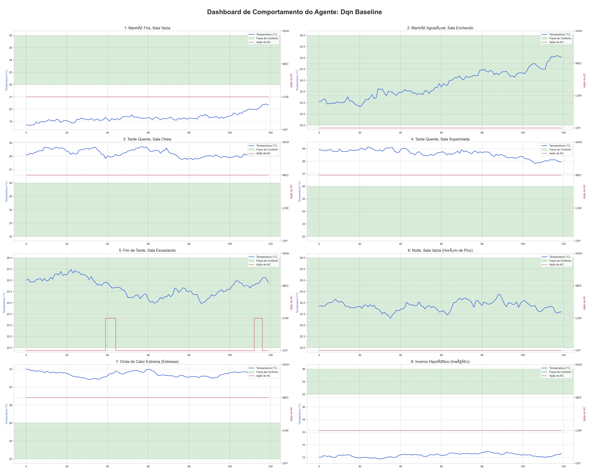
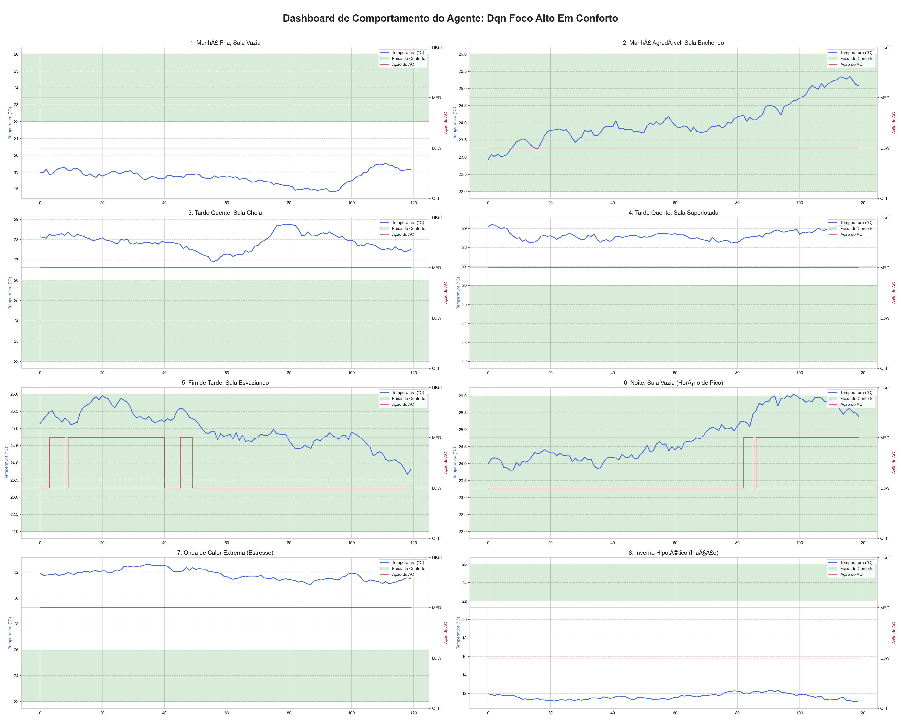
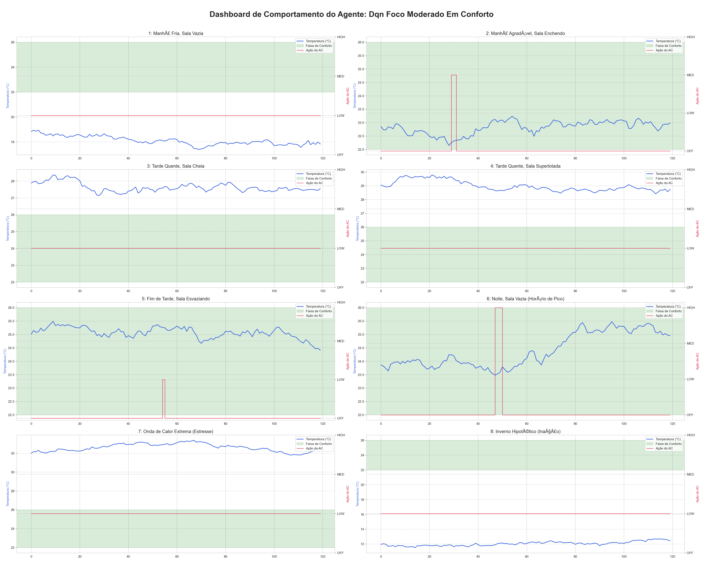
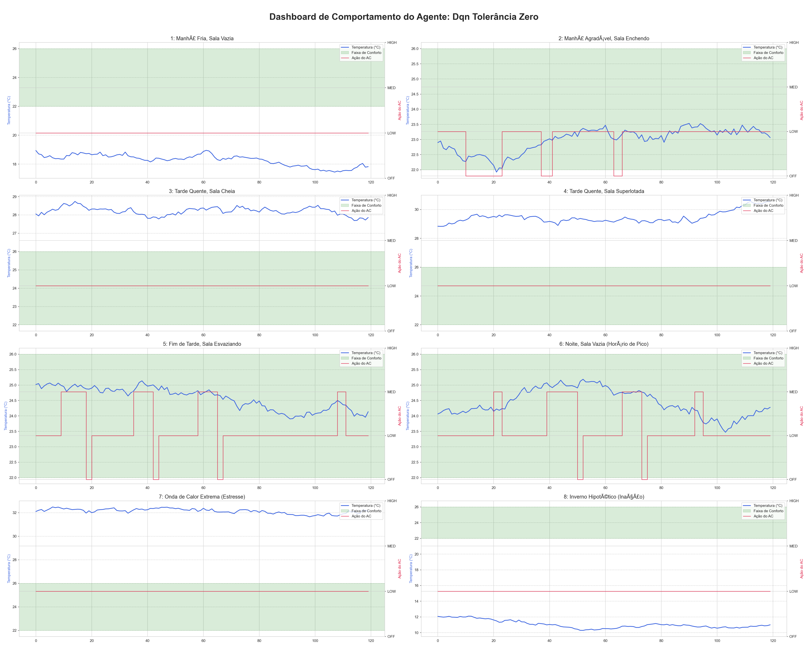

# Relatório de Análise de Agentes - results_20251007_141415

---

## 🔎 Agente: `Dqn Baseline`

<strong>Clique para ver Parâmetros de Configuração</strong>

#### Parâmetros do Agente
|               |      Valor |
|:--------------|-----------:|
| state_size    |      4     |
| action_size   |      4     |
| episodes      |   2000     |
| buffer_size   | 100000     |
| batch_size    |     64     |
| gamma         |      0.99  |
| alpha         |      0.001 |
| tau           |      0.001 |
| update_every  |      4     |
| epsilon_start |      1     |
| epsilon_decay |      0.995 |
| epsilon_min   |      0.01  |

#### Parâmetros do Ambiente
|                                | Valor                                                                                   |
|:-------------------------------|:----------------------------------------------------------------------------------------|
| length                         | 8.0                                                                                     |
| width                          | 6.0                                                                                     |
| height                         | 3.0                                                                                     |
| max_occupancy                  | 30                                                                                      |
| thermal_mass                   | 1000.0                                                                                  |
| heat_transfer_coeff            | 0.5                                                                                     |
| heat_gain_per_person           | 0.1                                                                                     |
| temp_comfort_min               | 22.0                                                                                    |
| temp_comfort_max               | 26.0                                                                                    |
| temp_very_cold                 | 18.0                                                                                    |
| temp_very_hot                  | 30.0                                                                                    |
| initial_temp                   | 24.0                                                                                    |
| season                         | summer                                                                                  |
| energy_cost_peak_hours         | [18, 21]                                                                                |
| energy_penalty_multiplier_peak | 1.5                                                                                     |
| ac_cooling_power               | {'ACState.OFF': 0.0, 'ACState.LOW': 2.0, 'ACState.MEDIUM': 4.0, 'ACState.HIGH': 6.0}    |
| ac_energy_consumption          | {'ACState.OFF': 0.0, 'ACState.LOW': 1.5, 'ACState.MEDIUM': 3.0, 'ACState.HIGH': 5.0}    |
| reward_structure               | {'VERY_COLD': -15.0, 'COLD': -5.0, 'COMFORTABLE': 1.0, 'WARM': -5.0, 'VERY_HOT': -15.0} |

### Dashboard de Comportamento em Cenários

---

## 🔎 Agente: `Dqn Foco Alto Em Conforto`

<strong>Clique para ver Parâmetros de Configuração</strong>

#### Parâmetros do Agente
|               |      Valor |
|:--------------|-----------:|
| state_size    |      4     |
| action_size   |      4     |
| episodes      |   2000     |
| buffer_size   | 100000     |
| batch_size    |     64     |
| gamma         |      0.99  |
| alpha         |      0.001 |
| tau           |      0.001 |
| update_every  |      4     |
| epsilon_start |      1     |
| epsilon_decay |      0.995 |
| epsilon_min   |      0.01  |

#### Parâmetros do Ambiente
|                                | Valor                                                                                    |
|:-------------------------------|:-----------------------------------------------------------------------------------------|
| length                         | 8.0                                                                                      |
| width                          | 6.0                                                                                      |
| height                         | 3.0                                                                                      |
| max_occupancy                  | 30                                                                                       |
| thermal_mass                   | 1000.0                                                                                   |
| heat_transfer_coeff            | 0.5                                                                                      |
| heat_gain_per_person           | 0.1                                                                                      |
| temp_comfort_min               | 22.0                                                                                     |
| temp_comfort_max               | 26.0                                                                                     |
| temp_very_cold                 | 18.0                                                                                     |
| temp_very_hot                  | 30.0                                                                                     |
| initial_temp                   | 24.0                                                                                     |
| season                         | summer                                                                                   |
| energy_cost_peak_hours         | [18, 21]                                                                                 |
| energy_penalty_multiplier_peak | 1.5                                                                                      |
| ac_cooling_power               | {'ACState.OFF': 0.0, 'ACState.LOW': 2.0, 'ACState.MEDIUM': 4.0, 'ACState.HIGH': 6.0}     |
| ac_energy_consumption          | {'ACState.OFF': 0.0, 'ACState.LOW': 1.5, 'ACState.MEDIUM': 3.0, 'ACState.HIGH': 5.0}     |
| reward_structure               | {'COMFORTABLE': 10.0, 'WARM': -5.0, 'VERY_HOT': -15.0, 'COLD': -5.0, 'VERY_COLD': -15.0} |

### Dashboard de Comportamento em Cenários

---

## 🔎 Agente: `Dqn Foco Moderado Em Conforto`

<strong>Clique para ver Parâmetros de Configuração</strong>

#### Parâmetros do Agente
|               |      Valor |
|:--------------|-----------:|
| state_size    |      4     |
| action_size   |      4     |
| episodes      |   2000     |
| buffer_size   | 100000     |
| batch_size    |     64     |
| gamma         |      0.99  |
| alpha         |      0.001 |
| tau           |      0.001 |
| update_every  |      4     |
| epsilon_start |      1     |
| epsilon_decay |      0.995 |
| epsilon_min   |      0.01  |

#### Parâmetros do Ambiente
|                                | Valor                                                                                   |
|:-------------------------------|:----------------------------------------------------------------------------------------|
| length                         | 8.0                                                                                     |
| width                          | 6.0                                                                                     |
| height                         | 3.0                                                                                     |
| max_occupancy                  | 30                                                                                      |
| thermal_mass                   | 1000.0                                                                                  |
| heat_transfer_coeff            | 0.5                                                                                     |
| heat_gain_per_person           | 0.1                                                                                     |
| temp_comfort_min               | 22.0                                                                                    |
| temp_comfort_max               | 26.0                                                                                    |
| temp_very_cold                 | 18.0                                                                                    |
| temp_very_hot                  | 30.0                                                                                    |
| initial_temp                   | 24.0                                                                                    |
| season                         | summer                                                                                  |
| energy_cost_peak_hours         | [18, 21]                                                                                |
| energy_penalty_multiplier_peak | 1.5                                                                                     |
| ac_cooling_power               | {'ACState.OFF': 0.0, 'ACState.LOW': 2.0, 'ACState.MEDIUM': 4.0, 'ACState.HIGH': 6.0}    |
| ac_energy_consumption          | {'ACState.OFF': 0.0, 'ACState.LOW': 1.5, 'ACState.MEDIUM': 3.0, 'ACState.HIGH': 5.0}    |
| reward_structure               | {'COMFORTABLE': 5.0, 'WARM': -5.0, 'VERY_HOT': -15.0, 'COLD': -5.0, 'VERY_COLD': -15.0} |

### Dashboard de Comportamento em Cenários

---

## 🔎 Agente: `Dqn Tolerância Zero`

<strong>Clique para ver Parâmetros de Configuração</strong>

#### Parâmetros do Agente
|               |      Valor |
|:--------------|-----------:|
| state_size    |      4     |
| action_size   |      4     |
| episodes      |   2000     |
| buffer_size   | 100000     |
| batch_size    |     64     |
| gamma         |      0.99  |
| alpha         |      0.001 |
| tau           |      0.001 |
| update_every  |      4     |
| epsilon_start |      1     |
| epsilon_decay |      0.995 |
| epsilon_min   |      0.01  |

#### Parâmetros do Ambiente
|                                | Valor                                                                                      |
|:-------------------------------|:-------------------------------------------------------------------------------------------|
| length                         | 8.0                                                                                        |
| width                          | 6.0                                                                                        |
| height                         | 3.0                                                                                        |
| max_occupancy                  | 30                                                                                         |
| thermal_mass                   | 1000.0                                                                                     |
| heat_transfer_coeff            | 0.5                                                                                        |
| heat_gain_per_person           | 0.1                                                                                        |
| temp_comfort_min               | 22.0                                                                                       |
| temp_comfort_max               | 26.0                                                                                       |
| temp_very_cold                 | 18.0                                                                                       |
| temp_very_hot                  | 30.0                                                                                       |
| initial_temp                   | 24.0                                                                                       |
| season                         | summer                                                                                     |
| energy_cost_peak_hours         | [18, 21]                                                                                   |
| energy_penalty_multiplier_peak | 1.5                                                                                        |
| ac_cooling_power               | {'ACState.OFF': 0.0, 'ACState.LOW': 2.0, 'ACState.MEDIUM': 4.0, 'ACState.HIGH': 6.0}       |
| ac_energy_consumption          | {'ACState.OFF': 0.0, 'ACState.LOW': 1.5, 'ACState.MEDIUM': 3.0, 'ACState.HIGH': 5.0}       |
| reward_structure               | {'COMFORTABLE': 10.0, 'WARM': -10.0, 'VERY_HOT': -30.0, 'COLD': -10.0, 'VERY_COLD': -30.0} |

### Dashboard de Comportamento em Cenários

